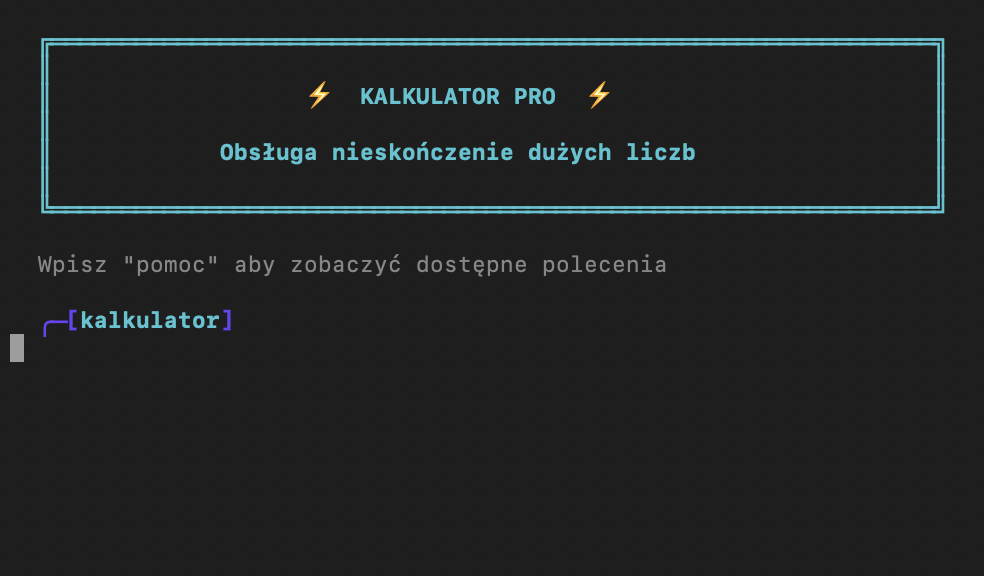
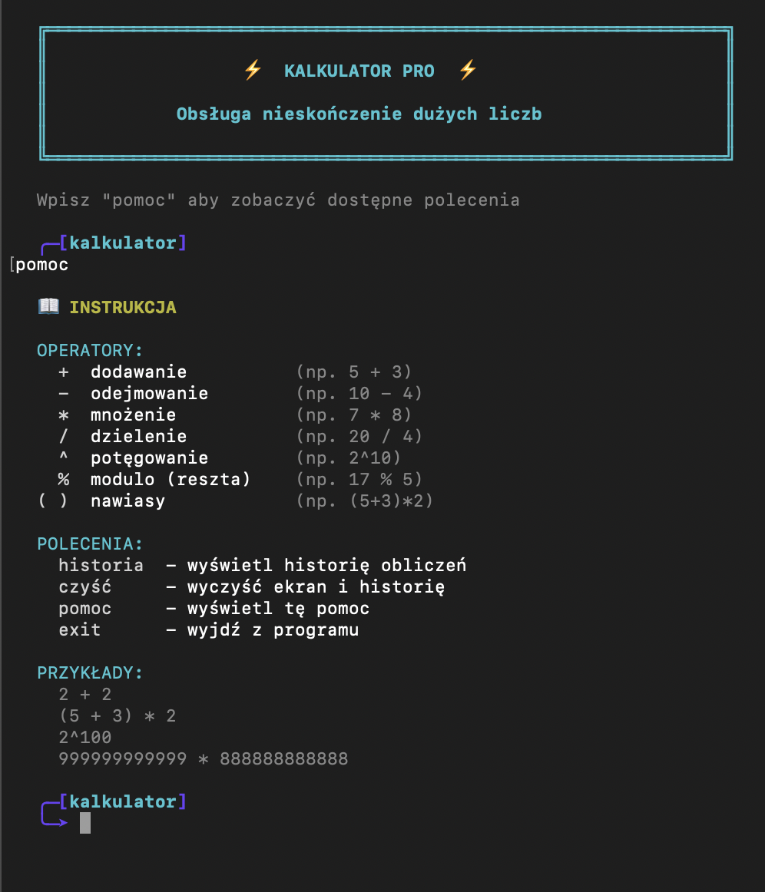
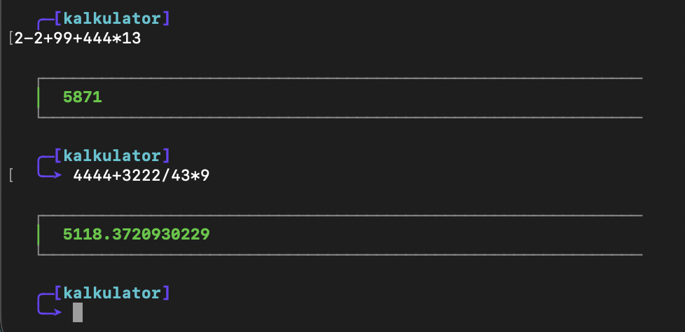
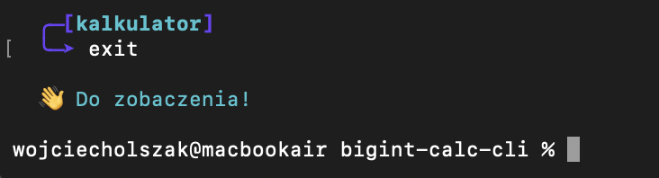

# bigint-calc-cli


A terminal-based calculator written in TypeScript with native BigInt support for arbitrarily large integer arithmetic. Features an interactive REPL with colorful ANSI output, Unicode box-drawing frames, full parenthesized expressions, and operator precedence -- all with zero external dependencies.

## Screenshots

### Welcome & Help

<p align="center">
  
</p>

<p align="center">
  <sub>REPL start with stylized KALKULATOR PRO banner and Unicode box-drawing frame</sub>
</p>

<p align="center">
  
</p>

<p align="center">
  <sub>Built-in help: operators (+, -, *, /, ^, %), commands (historia, czyść, pomoc, exit), and examples</sub>
</p>

### Calculations & History

<p align="center">
  
</p>

<p align="center">
  <sub>Evaluating expressions with operator precedence: <code>2-2+99+444*13 = 5871</code> and <code>4444+3222/43*9 = 5118.37...</code></sub>
</p>

<p align="center">
  
</p>

<p align="center">
  <sub>Calculation history with numbered entries and color-highlighted results</sub>
</p>

<p align="center">
  
</p>

<p align="center">
  <sub>Graceful exit with goodbye message</sub>
</p>

---

## Features

- **BigInt arbitrary precision** -- compute with integers of unlimited size
- **Full operator set** -- addition, subtraction, multiplication, division, exponentiation, modulo
- **Parenthesized expressions** -- unlimited nesting depth with correct evaluation
- **Operator precedence** -- standard mathematical order of operations
- **Calculation history** -- browse previously computed results
- **Colorful terminal UI** -- ANSI escape codes with Unicode box-drawing frames
- **Polish commands** -- CLI prompts and commands in Polish
- **Zero dependencies** -- no external packages required at runtime

## Tech Stack

| Component | Technology |
|-----------|------------|
| Language | TypeScript |
| Runtime | Node.js |
| Precision | BigInt (native) |
| Terminal styling | ANSI escape codes (no libraries) |
| Build | tsc (TypeScript compiler) |

## Getting Started

### Prerequisites

- Node.js 18+
- npm

### Installation

```bash
git clone https://github.com/selter2001/bigint-calc-cli.git
cd bigint-calc-cli
npm install
```

### Running

```bash
npm start
# or: npx ts-node src/index.ts
```

### Building

Compile to JavaScript with `npx tsc` -- output is written to `dist/`.

## Architecture

The application is a single-file TypeScript module:

```
bigint-calc-cli/
├── src/
│   └── index.ts       # Tokenizer, parser, evaluator, REPL
├── dist/              # Compiled JavaScript (generated by tsc)
├── tsconfig.json      # TypeScript configuration
├── package.json
└── README.md
```

`src/index.ts` contains a lexer, a recursive-descent parser that builds an expression tree respecting operator precedence and parentheses, and an evaluator using BigInt arithmetic. The REPL loop handles interaction, history, and styled rendering.

## Author

**Wojciech Olszak** -- [github.com/selter2001](https://github.com/selter2001)

## License

This project is licensed under the MIT License. See the [LICENSE](LICENSE) file for details.

---

# bigint-calc-cli


Terminalowy kalkulator napisany w TypeScript z natywną obsługą BigInt do arytmetyki na dowolnie dużych liczbach całkowitych. Oferuje interaktywny REPL z kolorowym wyjściem ANSI, ramkami Unicode, pełną obsługą wyrażeń w nawiasach i priorytetem operatorów -- bez żadnych zewnętrznych zależności.

## Zrzuty ekranu

### Powitanie i pomoc

<p align="center">
  
</p>

<p align="center">
  <sub>Start REPL ze stylizowanym banerem KALKULATOR PRO i ramką Unicode</sub>
</p>

<p align="center">
  
</p>

<p align="center">
  <sub>Wbudowana pomoc: operatory (+, -, *, /, ^, %), polecenia (historia, czyść, pomoc, exit) i przykłady</sub>
</p>

### Obliczenia i historia

<p align="center">
  
</p>

<p align="center">
  <sub>Ewaluacja wyrażeń z priorytetem operatorów: <code>2-2+99+444*13 = 5871</code> i <code>4444+3222/43*9 = 5118.37...</code></sub>
</p>

<p align="center">
  
</p>

<p align="center">
  <sub>Historia obliczeń z numerowanymi wpisami i kolorowymi wynikami</sub>
</p>

<p align="center">
  
</p>

<p align="center">
  <sub>Zakończenie programu z komunikatem pożegnalnym</sub>
</p>

---

## Funkcjonalności

- **Dowolna precyzja BigInt** -- obliczenia na liczbach całkowitych bez limitu wielkości
- **Pełny zestaw operatorów** -- dodawanie, odejmowanie, mnożenie, dzielenie, potęgowanie, modulo
- **Wyrażenia w nawiasach** -- nieograniczona głębokość zagnieżdżenia
- **Priorytet operatorów** -- standardowa matematyczna kolejność działań
- **Historia obliczeń** -- przeglądanie wcześniejszych wyników
- **Kolorowy terminal** -- kody ANSI z ramkami Unicode
- **Polskie komendy** -- komunikaty CLI w języku polskim
- **Zero zależności** -- brak zewnętrznych pakietów w czasie wykonania

## Stos technologiczny

| Komponent | Technologia |
|-----------|-------------|
| Język | TypeScript |
| Środowisko | Node.js |
| Precyzja | BigInt (natywny) |
| Stylizacja terminala | Kody ANSI (bez bibliotek) |
| Budowanie | tsc (kompilator TypeScript) |

## Uruchomienie

### Wymagania

- Node.js 18+
- npm

### Instalacja

```bash
git clone https://github.com/selter2001/bigint-calc-cli.git
cd bigint-calc-cli
npm install
```

### Uruchomienie aplikacji

```bash
npm start
# lub: npx ts-node src/index.ts
```

### Budowanie

Kompilacja do JavaScript: `npx tsc` -- wynik zapisywany do katalogu `dist/`.

## Architektura

Aplikacja zaimplementowana jako pojedynczy moduł TypeScript:

```
bigint-calc-cli/
├── src/
│   └── index.ts       # Tokenizer, parser, ewaluator, REPL
├── dist/              # Skompilowany JavaScript (generowany przez tsc)
├── tsconfig.json      # Konfiguracja TypeScript
├── package.json
└── README.md
```

`src/index.ts` zawiera lekser, parser rekursywny budujący drzewo wyrażeń z uwzględnieniem priorytetu operatorów i nawiasów oraz ewaluator korzystający z arytmetyki BigInt. Pętla REPL obsługuje interakcję, historię i stylizowane renderowanie.

## Autor

**Wojciech Olszak** -- [github.com/selter2001](https://github.com/selter2001)

## Licencja

Projekt jest objęty licencją MIT. Szczegóły w pliku [LICENSE](LICENSE).
